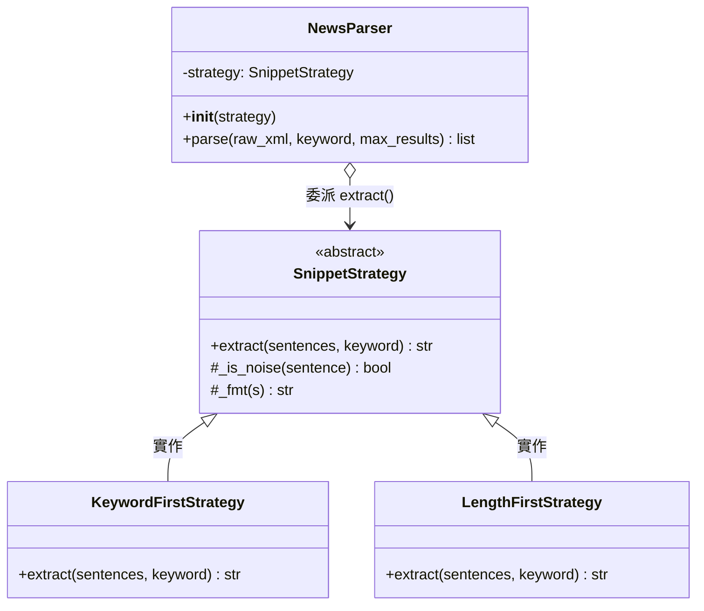
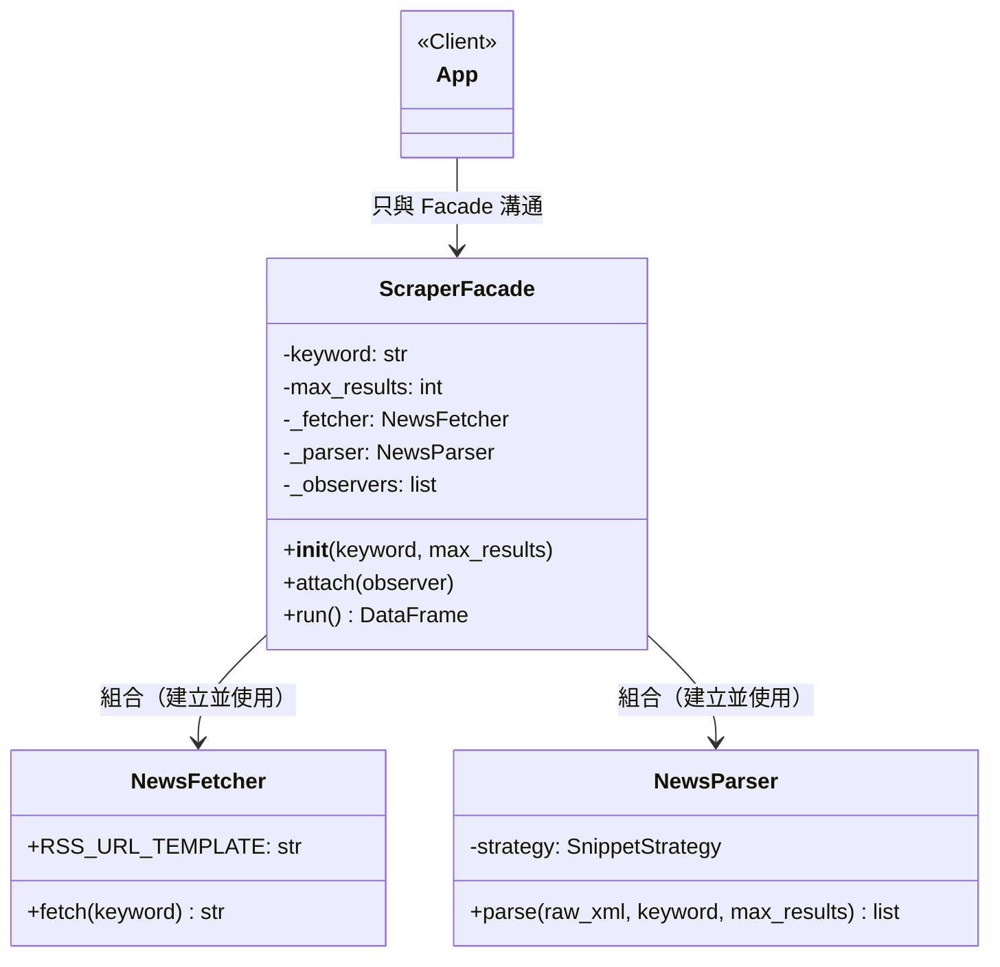
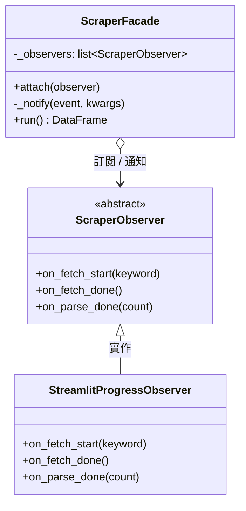

# Design Pattern 使用說明文件

> **專案**：關鍵字爬蟲整合系統（`scraper.py` + `app.py`）
> **實作日期**：2026-05-20
>
> 本文件說明本專案在哪個位置、以哪種方式應用了三種 Design Pattern，
> 並解釋套用前後的設計差異與效益。

---

## 一、Strategy Pattern（策略模式）

### 套用位置

| 項目 | 說明 |
|------|------|
| **檔案** | `scraper.py` |
| **Pattern 角色** | `SnippetStrategy`（Strategy 介面）、`KeywordFirstStrategy`、`LengthFirstStrategy`（ConcreteStrategy）、`NewsParser`（Context） |
| **觸發方法** | `NewsParser.parse()` → `self.strategy.extract(sentences, keyword)` |

### 套用前的問題

原始 `Scraper._extract_snippet()` 方法將三種選取邏輯硬寫在同一個方法裡：

```python
# 原始程式碼（scraper.py 第 120–165 行）
def _extract_snippet(self, description: str, keyword: str = "") -> str:
    ...
    # 1. 含關鍵字 + >= 20 字
    if keyword:
        for s in clean:
            if len(s) >= 20 and keyword in s:
                return fmt(s)
    # 2. >= 50 字
    for s in clean:
        if len(s) >= 50:
            return fmt(s)
    # 3. >= 20 字
    for s in clean:
        if len(s) >= 20:
            return fmt(s)
    return ""
```

**問題**：若要改變選取策略（如改為純長度優先），必須直接修改 `Scraper` 類別，違反開放封閉原則（OCP）。

### 套用後的結構

```python
# 新程式碼（scraper.py 末尾追加）
class SnippetStrategy(ABC):           # Strategy 介面
    @abstractmethod
    def extract(self, sentences, keyword) -> str: ...

class KeywordFirstStrategy(SnippetStrategy):   # ConcreteStrategy A
    def extract(self, sentences, keyword) -> str:
        # 關鍵字優先邏輯
        ...

class LengthFirstStrategy(SnippetStrategy):    # ConcreteStrategy B
    def extract(self, sentences, keyword) -> str:
        # 純長度優先邏輯（忽略 keyword）
        ...

class NewsParser:                      # Context
    def __init__(self, strategy: SnippetStrategy = None):
        self.strategy = strategy or KeywordFirstStrategy()

    def parse(self, raw_xml, keyword, max_results):
        ...
        snippet = self.strategy.extract(sentences, keyword)  # 委派給策略
```

### 效益

- **可擴展**：新增第三種選取策略只需新增類別，不修改 `NewsParser`（符合 OCP）
- **可替換**：建立 `NewsParser(strategy=LengthFirstStrategy())` 即可在執行期切換
- **可測試**：每個策略可獨立單元測試

### UML 類別圖



---

## 二、Facade Pattern（外觀模式）

### 套用位置

| 項目 | 說明 |
|------|------|
| **檔案** | `scraper.py`（新增類別）、`app.py`（呼叫端） |
| **Pattern 角色** | `ScraperFacade`（Facade）、`NewsFetcher`（Subsystem A）、`NewsParser`（Subsystem B）、`app.py`（Client） |
| **統一介面** | `ScraperFacade.run()` |

### 套用前的問題

原始 `app.py` 直接使用 `Scraper` 類別，而 `Scraper` 本身混合了 HTTP 爬取、XML 解析、文字萃取等職責：

```python
# 原始 app.py
from scraper import Scraper
scraper = Scraper(keyword=keyword, max_results=10)
df = scraper.run()  # 這看起來簡潔，但 Scraper 內部職責混亂
```

原始 `Scraper` 類別：HTTP headers、timeout、BeautifulSoup 解析、pubDate 格式化、URL 解析全部在同一個類別，職責不清晰，難以單獨替換任一子功能。

### 套用後的結構

```python
# 新程式碼（scraper.py 末尾追加）
class NewsFetcher:              # 子系統 A：只管 HTTP
    def fetch(self, keyword: str) -> str:
        # URL 組建、headers、timeout、sleep...
        return raw_xml

class NewsParser:               # 子系統 B：只管 XML 解析
    def parse(self, raw_xml, keyword, max_results) -> list[dict]:
        # BeautifulSoup、欄位提取、策略委派...

class ScraperFacade:            # Facade：統一對外介面
    def __init__(self, keyword, max_results=10):
        self._fetcher = NewsFetcher()   # 組合子系統
        self._parser = NewsParser()

    def run(self) -> pd.DataFrame:     # 唯一對外介面
        raw_xml = self._fetcher.fetch(self.keyword)
        results = self._parser.parse(raw_xml, ...)
        return pd.DataFrame(results).sort_values(...)

# 新 app.py
from scraper import ScraperFacade
scraper = ScraperFacade(keyword=keyword, max_results=10)
df = scraper.run()  # 介面不變，但背後已是三層架構
```

### 效益

- **降低耦合**：`app.py` 不需知道 `NewsFetcher`、`NewsParser` 的存在
- **職責清晰**：HTTP 邏輯集中在 `NewsFetcher`，解析邏輯集中在 `NewsParser`
- **易於替換**：可獨立換掉 `NewsFetcher`（如換成 `aiohttp`）而不影響其他部分

### UML 類別圖



---

## 三、Observer Pattern（觀察者模式）

### 套用位置

| 項目 | 說明 |
|------|------|
| **檔案** | `scraper.py`（Subject + Observer）、`app.py`（訂閱方） |
| **Pattern 角色** | `ScraperFacade`（Subject）、`ScraperObserver`（Observer 介面）、`StreamlitProgressObserver`（ConcreteObserver） |
| **事件** | `on_fetch_start`、`on_fetch_done`、`on_parse_done` |

### 套用前的問題

原始 `app.py` 用 `st.spinner()` 硬碼在 UI 層控制所有進度顯示邏輯，爬蟲模組對此一無所知：

```python
# 原始 app.py
with st.spinner(f'正在爬取...'):
    scraper = Scraper(keyword=keyword, max_results=10)
    df = scraper.run()  # 爬蟲不知道有 spinner 的存在
```

**問題**：進度顯示邏輯完全集中在 UI 層，無法做到「fetch 完成後立即更新狀態、parse 完成後再更新」的細粒度通知；也無法在爬蟲中加入日誌、監控等觀察行為而不修改 UI。

### 套用後的結構

```python
# 新程式碼（scraper.py）
class ScraperObserver(ABC):        # Observer 介面
    @abstractmethod
    def on_fetch_start(self, keyword): ...
    @abstractmethod
    def on_fetch_done(self): ...
    @abstractmethod
    def on_parse_done(self, count): ...

class StreamlitProgressObserver(ScraperObserver):  # ConcreteObserver
    def on_fetch_start(self, keyword):
        try:
            import streamlit as st
            st.session_state["scrape_status"] = "fetching"
        except Exception: pass

    def on_fetch_done(self):
        try:
            import streamlit as st
            st.session_state["scrape_status"] = "parsing"
        except Exception: pass

    def on_parse_done(self, count):
        try:
            import streamlit as st
            st.session_state["scrape_status"] = "done"
            st.session_state["scrape_count"] = count
        except Exception: pass

# ScraperFacade（Subject）在 run() 各階段發布事件
def run(self) -> pd.DataFrame:
    self._notify("on_fetch_start", keyword=self.keyword)  # 通知
    raw_xml = self._fetcher.fetch(self.keyword)
    self._notify("on_fetch_done")                          # 通知
    results = self._parser.parse(...)
    self._notify("on_parse_done", count=len(results))      # 通知
    ...

# 新 app.py：訂閱觀察者
scraper = ScraperFacade(keyword=keyword, max_results=10)
scraper.attach(StreamlitProgressObserver())   # 訂閱
df = scraper.run()
```

### 效益

- **解耦**：`ScraperFacade` 不依賴 Streamlit，可在任何環境執行
- **可擴展**：可同時訂閱多個觀察者（如同時記錄日誌 + 更新 UI）而不修改核心邏輯
- **細粒度通知**：爬取各階段（fetch 前、fetch 後、parse 後）分別通知，UI 可呈現更精準的進度

### UML 類別圖



---

## 四、三個模式如何協同運作

三個 Design Pattern 在爬蟲流程中扮演互補的角色，形成一個有機的整體：

```
app.py（Client）
    │
    ▼
ScraperFacade.run()         ← Facade Pattern：統一入口，隱藏子系統
    │
    ├─① _notify("on_fetch_start")  ← Observer Pattern：通知 UI 開始
    │
    ├─② NewsFetcher.fetch()        ← Facade 子系統 A：純 HTTP 職責
    │
    ├─③ _notify("on_fetch_done")   ← Observer Pattern：通知 UI 正在解析
    │
    ├─④ NewsParser.parse()         ← Facade 子系統 B：純解析職責
    │       │
    │       └── strategy.extract() ← Strategy Pattern：可替換的萃取邏輯
    │
    ├─⑤ _notify("on_parse_done")   ← Observer Pattern：通知 UI 完成
    │
    └─⑥ return DataFrame
```

**三個模式的分工**：

| Pattern | 解決的問題 | 在本專案中的角色 |
|---------|-----------|----------------|
| **Facade** | 子系統過於複雜，客戶端難以使用 | 讓 `app.py` 只需一行 `facade.run()` |
| **Strategy** | 某一步驟的演算法需要靈活替換 | 讓 snippet 選取策略可在不修改 `NewsParser` 的情況下切換 |
| **Observer** | 某一事件發生時需要通知多個物件 | 讓 `ScraperFacade` 在各爬取階段自動通知 UI，而不直接依賴 Streamlit |

**組合的設計效益**：
- `ScraperFacade`（Facade）是整個架構的對外窗口，同時也是 Observer Pattern 的 Subject
- `NewsParser`（Facade 的子系統）內部使用 Strategy Pattern，讓兩個關注點（解析邏輯 vs. 萃取策略）獨立演化
- 三個 pattern 層層疊加，但職責邊界清晰，任何一個 pattern 都可以獨立理解、替換或擴展

---

*文件生成日期：2026-05-20*
*相關檔案：`scraper.py`、`app.py`、`design_patterns_reference.md`*
