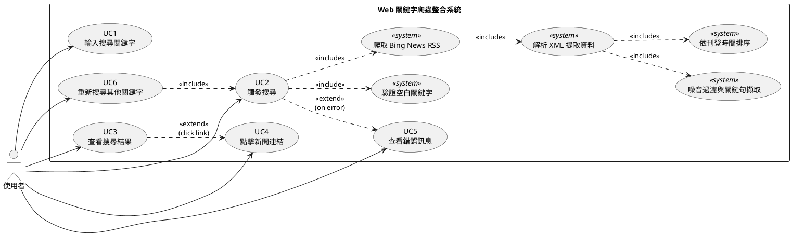
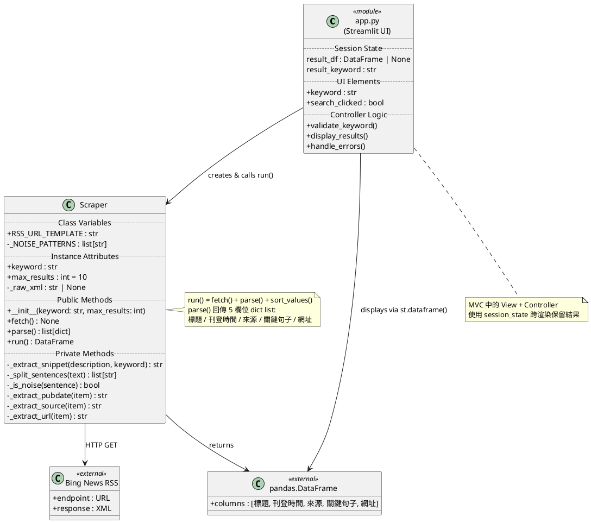
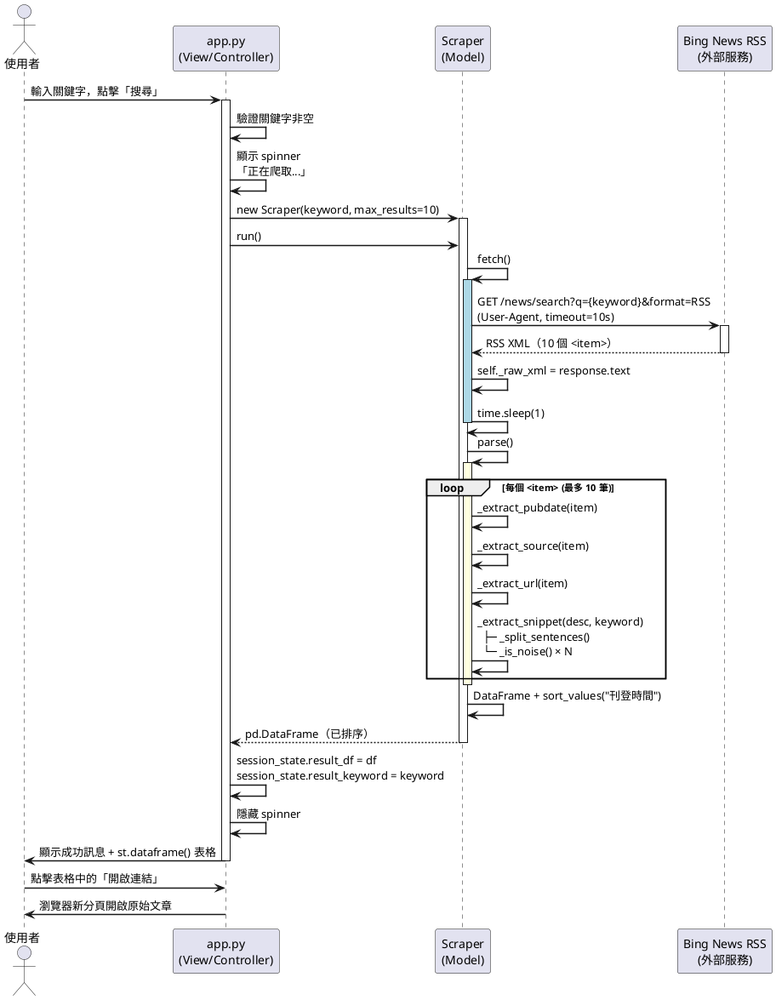
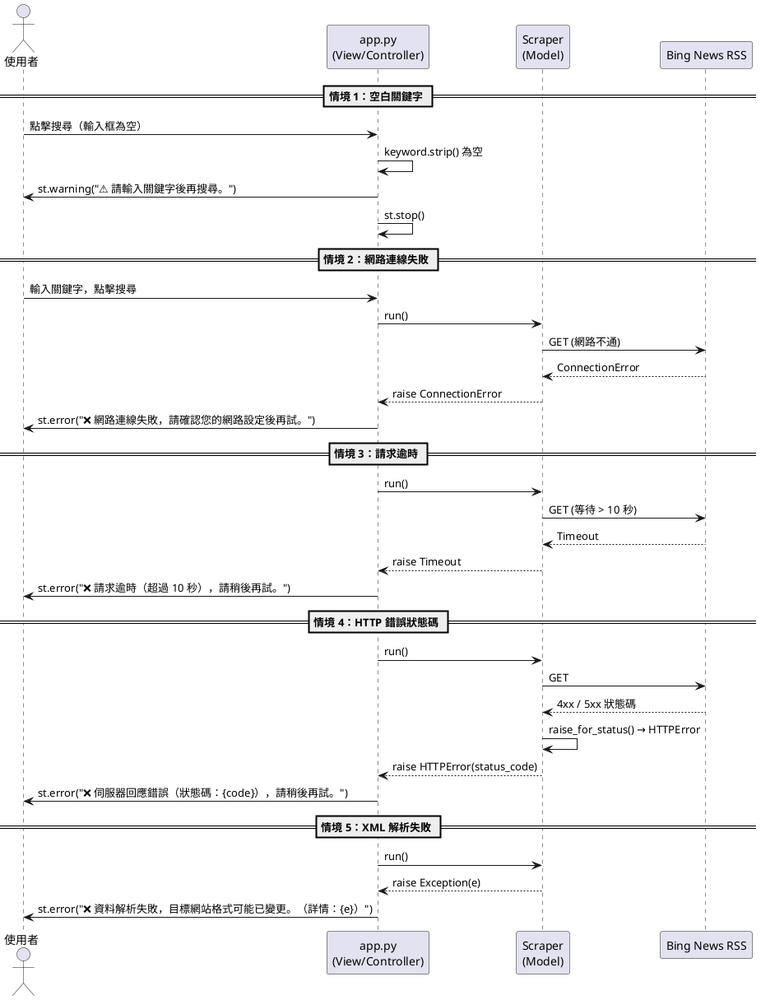
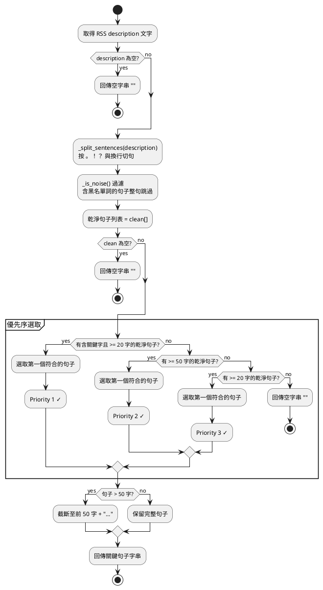

# Web 關鍵字爬蟲整合系統 — 報告素材彙整

> 本文件為上台報告用素材，涵蓋系統架構、程式細節、UML 圖表、流程說明。
> 最後更新：2026-04-10

---

## 一、系統概述

### 系統名稱
Web 關鍵字爬蟲整合系統（Web Keyword Scraper Integration System）

### 系統目的
讓使用者輸入關鍵字後，系統自動從 **Bing News RSS Feed** 爬取相關新聞，並以互動式表格呈現：標題、刊登時間、來源、關鍵句子、原始網址。

### 技術棧（Tech Stack）

| 層次 | 技術 | 版本需求 | 用途 |
|---|---|---|---|
| UI 框架 | Streamlit | >= 1.32.0 | 前端頁面渲染 |
| HTTP 請求 | requests | >= 2.31.0 | 向 Bing News 發 GET 請求 |
| HTML/XML 解析 | BeautifulSoup4 + lxml | >= 4.12.0 / >= 5.0.0 | 解析 RSS XML |
| 資料處理 | Pandas | >= 2.0.0 | 結果轉 DataFrame 與排序 |
| 時間解析 | email.utils（標準庫） | — | 解析 RFC 2822 pubDate |
| URL 解析 | urllib.parse（標準庫） | — | 解析 Bing redirect URL |

---

## 二、系統架構設計

### MVC 三層架構

```
┌─────────────────────────────────────────────────────────┐
│                     app.py                              │
│          View Layer  ＋  Controller Layer               │
│  ┌──────────────────┐    ┌───────────────────────────┐  │
│  │  View（Streamlit）│    │  Controller（流程控制）    │  │
│  │ • 輸入框 / 按鈕   │    │ • 驗證空白關鍵字           │  │
│  │ • spinner        │───▶│ • 呼叫 Scraper.run()      │  │
│  │ • dataframe 表格  │    │ • 捕獲例外顯示錯誤訊息    │  │
│  │ • 錯誤訊息        │    │ • 存取 session_state      │  │
│  └──────────────────┘    └───────────────────────────┘  │
└───────────────────────────────────┬─────────────────────┘
                                    │ 呼叫 run()
                                    ▼
┌─────────────────────────────────────────────────────────┐
│                    scraper.py                           │
│                 Model Layer（Scraper 類別）              │
│                                                         │
│  Scraper(keyword, max_results=10)                       │
│  ├── fetch()      → HTTP GET → Bing News RSS            │
│  ├── parse()      → XML 解析 → list[dict]               │
│  └── run()        → fetch + parse + sort → DataFrame   │
└─────────────────────────────────────────────────────────┘
                                    │
                                    ▼ HTTP GET
                    ┌───────────────────────────┐
                    │   Bing News RSS Feed       │
                    │  (外部資料來源)             │
                    └───────────────────────────┘
```

### 檔案結構

```
soft-ware-design(scraper)/
├── app.py            # View + Controller（Streamlit UI）
├── scraper.py        # Model（Scraper 類別）
├── requirements.txt  # 依賴套件清單
└── .streamlit/
    └── config.toml   # Streamlit 執行設定
```

---

## 三、Scraper 類別程式細節

### 3.1 類別屬性

```python
class Scraper:
    # 類別變數（Class Variable）
    RSS_URL_TEMPLATE = "https://www.bing.com/news/search?q={keyword}&format=RSS"
    _NOISE_PATTERNS = [
        "設為首選來源", "查看更多我們的精彩報導",
        "在 Google 上查看", "在 Yahoo 上查看",
        "致力為全球華文受眾", "提供獨立、可信、中立",
        "擁有國際視角、深度、廣度和維度",
        "訂閱電子報", "加入會員",
    ]

    # 實例變數（Instance Variable）
    self.keyword    : str       # 搜尋關鍵字（去除前後空白）
    self.max_results: int       # 最大結果數，預設 10
    self._raw_xml   : str|None  # 原始 XML（fetch 後才有值）
```

### 3.2 公開方法（Public Methods）

#### `fetch() → None`
- 建構 Bing News RSS URL，加入 URL encode 的關鍵字
- 發出 GET 請求，設定 timeout=10s、User-Agent header
- 呼叫 `raise_for_status()` 確保無 HTTP 錯誤
- 儲存原始 XML 至 `self._raw_xml`
- 執行 `time.sleep(1)`（爬蟲禮儀）

#### `parse() → list[dict]`
- 用 BeautifulSoup + lxml-xml 解析 `_raw_xml`
- 取得所有 `<item>`，限制在 `max_results` 以內
- 對每個 item 呼叫私有提取方法
- 回傳 `[{"標題", "刊登時間", "來源", "關鍵句子", "網址"}, ...]`

#### `run() → pd.DataFrame`
- 呼叫 `fetch()` → `parse()` → 組成 DataFrame
- 依「刊登時間」降序排序（空值排最後）
- 重設 index 後回傳

### 3.3 私有方法（Private Methods）

#### `_extract_snippet(description, keyword) → str`
關鍵句子擷取的核心邏輯：
```
description 原文
    ↓ _split_sentences()
切句（依 。！？ 與換行符）
    ↓ _is_noise()
噪音過濾（黑名單詞 → 整句跳過）
    ↓
優先序選取乾淨句子：
  Priority 1: 含關鍵字 + >= 20 字
  Priority 2: >= 50 字
  Priority 3: >= 20 字
  Priority 4: 無乾淨句子 → 回傳 ""
    ↓
輸出：完整句 (<= 50 字) 或截斷 50 字 + "..."
```

#### `_split_sentences(text) → list[str]`
- 按 `。！？` 與換行符切句
- 每段去除前後空白後放入列表

#### `_is_noise(sentence) → bool`
- 句子中含任一 `_NOISE_PATTERNS` 樣板詞 → 回傳 True

#### `_extract_pubdate(item) → str`
- 從 `<pubDate>` 取 RFC 2822 時間字串
- 使用 `email.utils.parsedate_to_datetime` 解析
- 格式化為 `YYYY/MM/DD HH:MM`

#### `_extract_source(item) → str`
- 從 `<News:Source>` 取來源名稱
- 不存在時回傳「（未知來源）」

#### `_extract_url(item) → str`
- 從 `<link>` 取 Bing redirect URL
- 用 `urlparse` + `parse_qs` 解析 `url=` 參數
- 取不到時直接回傳 link 原始值

---

## 四、app.py Controller 流程細節

### 4.1 初始化流程

```python
# session_state 初始化（每次頁面載入檢查）
if "result_df" not in st.session_state:
    st.session_state.result_df = None
if "result_keyword" not in st.session_state:
    st.session_state.result_keyword = ""
```

### 4.2 搜尋觸發流程

```python
if search_clicked:
    # Step 1: 驗證空白關鍵字
    if not keyword or not keyword.strip():
        st.warning("⚠️ 請輸入關鍵字後再搜尋。")
        st.stop()

    # Step 2: 執行爬蟲（with spinner）
    with st.spinner(f'正在爬取「{keyword}」的相關新聞，請稍候...'):
        try:
            scraper = Scraper(keyword=keyword, max_results=10)
            df = scraper.run()
        except requests.exceptions.ConnectionError:
            st.error("❌ 網路連線失敗...")
        except requests.exceptions.Timeout:
            st.error("❌ 請求逾時（超過 10 秒）...")
        except requests.exceptions.HTTPError as e:
            st.error(f"❌ 伺服器回應錯誤（狀態碼：{status_code}）...")
        except Exception as e:
            st.error(f"❌ 資料解析失敗...（詳情：{e}）")

    # Step 3: 存入 session_state
    st.session_state.result_df = df
    st.session_state.result_keyword = keyword
```

### 4.3 結果顯示流程

```python
# 從 session_state 讀取（不依賴按鈕是否剛被點擊）
if st.session_state.result_df is not None:
    if df.empty:
        st.info(f"⚠️ 未找到「{saved_keyword}」的相關結果...")
    else:
        st.success(f"共找到 **{len(df)}** 筆結果（關鍵字：{saved_keyword}）")
        st.dataframe(df, column_config={...})
```

---

## 五、資料流（Data Flow）

```
使用者輸入關鍵字
        ↓
app.py 驗證非空
        ↓
Scraper(keyword, max_results=10) 建立實例
        ↓
scraper.run() 呼叫
    ↓
    scraper.fetch()
        ↓  URL encode 關鍵字
        →  GET https://www.bing.com/news/search?q=<keyword>&format=RSS
        ←  RSS XML 回應（約 10 個 <item>）
        ↓  time.sleep(1)
        儲存 self._raw_xml
    ↓
    scraper.parse()
        ↓  BeautifulSoup 解析 lxml-xml
        ↓  取所有 <item>[:10]
        ↓  每筆 item：
            _extract_pubdate() → "YYYY/MM/DD HH:MM"
            _extract_source()  → "媒體名稱"
            _extract_url()     → "https://原始文章網址"
            _extract_snippet() → "關鍵句子..."
              └─ _split_sentences() → 句子列表
              └─ _is_noise() × N   → 過濾噪音
        ↓  回傳 list[dict]
    ↓
    DataFrame 組成 + sort_values("刊登時間", ascending=False)
        ↓
回傳 pd.DataFrame 給 app.py
        ↓
存入 st.session_state.result_df
        ↓
st.dataframe() 顯示表格（5 欄，LinkColumn 網址）
        ↓
使用者看到結果 / 點擊連結
```

---

## 六、UML — Use Case Diagram（PlantUML 語法）



---

## 七、UML — Class Diagram（PlantUML 語法）



---

## 八、UML — Sequence Diagram（PlantUML 語法）

### 8.1 正常搜尋流程



### 8.2 錯誤處理流程



---

## 九、UML — Activity Diagram：關鍵句子擷取流程



---

## 十、錯誤處理對照表

| 例外類型 | 來源 | 顯示訊息 | 處理位置 |
|---|---|---|---|
| `ConnectionError` | requests | ❌ 網路連線失敗，請確認您的網路設定後再試。 | app.py Controller |
| `Timeout` | requests | ❌ 請求逾時（超過 10 秒），請稍後再試。 | app.py Controller |
| `HTTPError` | requests | ❌ 伺服器回應錯誤（狀態碼：{code}），請稍後再試。 | app.py Controller |
| `Exception` | BeautifulSoup / 其他 | ❌ 資料解析失敗，目標網站格式可能已變更。（詳情：{e}） | app.py Controller |
| 空白輸入 | 使用者 | ⚠️ 請輸入關鍵字後再搜尋。 | app.py Controller（搜尋前驗證） |
| 空結果 | Bing 搜尋 | ⚠️ 未找到「{keyword}」的相關結果，請嘗試其他關鍵字。 | app.py View |

---

## 十一、設計決策摘要

| 決策 | 選擇 | 主要理由 |
|---|---|---|
| 前端框架 | Streamlit | 無需 HTML/CSS，單一 Python 檔即可完成 UI |
| 爬取目標 | Bing News RSS | description 含文章摘要，適合關鍵句擷取 |
| 架構模式 | MVC（雙檔分離） | 最小化複雜度，同時維持 Model / View 分離 |
| 關鍵句擷取 | 規則式句子級過濾 | 無 AI 依賴，可解釋性高，易於教學說明 |
| URL 顯示 | `st.column_config.LinkColumn` | 安全無 XSS 風險，Streamlit 1.32+ 原生支援 |
| pubDate 解析 | `email.utils.parsedate_to_datetime` | 標準庫，無額外依賴 |
| 結果保留 | `st.session_state` | 防止 Streamlit 重渲染清空結果 |
| 爬蟲禮儀 | `time.sleep(1)` | 避免對 Bing 伺服器造成過大負擔 |
| 排序 | 依刊登時間降序 | 最新消息優先，符合新聞查詢習慣 |

---

## 十二、系統限制（Non-Goals & Constraints）

- 不支援資料持久化（無資料庫）
- 不支援使用者登入/權限管理
- 不支援非同步爬取（無 asyncio）
- 不支援動態 JavaScript 渲染頁面（無 Selenium）
- 不使用 AI/NLP 進行語意摘要
- 關鍵句子擷取長度上限為 50 字
- 搜尋結果上限預設 10 筆

---

## 十三、部署說明

```bash
# 1. 安裝依賴
pip install -r requirements.txt

# 2. 執行系統
streamlit run app.py
```

`requirements.txt` 內容：
```
streamlit>=1.32.0
requests>=2.31.0
beautifulsoup4>=4.12.0
pandas>=2.0.0
lxml>=5.0.0
```
