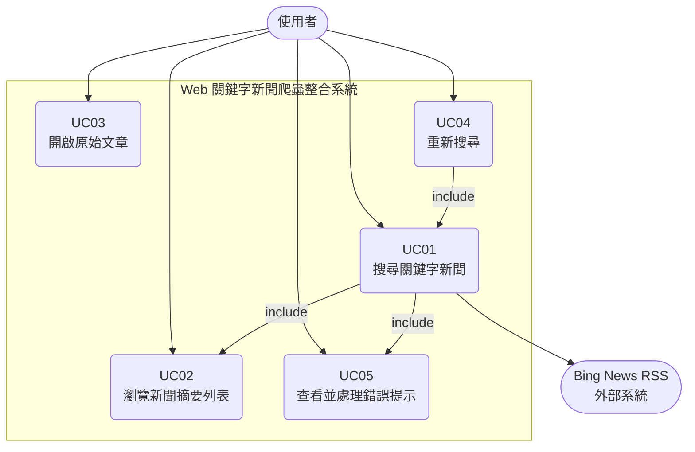
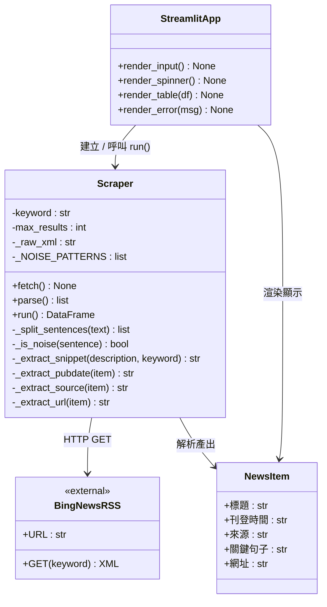

# Web 關鍵字新聞爬蟲整合系統

## 需求規格書

---

**專案成員**

| 學號 | 姓名 |
|------|------|
|      |      |
|      |      |

**日期：2025年11月28日**

---

## 一、專案緣起

### 背景

在資訊快速流通的現代社會，新聞報導每天以大量篇幅在各平台產生。無論是學生、研究人員或一般民眾，若想快速掌握某一主題（如「人工智慧」、「半導體」、「氣候變遷」）的最新動態，往往需要逐一開啟多個新聞網站，手動搜尋並閱讀，耗費大量時間與精力，效率低落。

現有的搜尋引擎雖然提供新聞搜尋功能，但其搜尋結果頁面設計複雜、摻雜廣告、並採用語意匹配（Semantic Matching）技術，使得搜尋「人工智慧」時可能混入僅與「AI」或「智慧城市」相關的報導，讓使用者難以一目瞭然地判斷每篇文章是否真正符合其搜尋需求。

### 製作動機

本專案旨在提供一個**以關鍵字為核心、自動化爬取並彙整新聞摘要**的輕量型工具，讓使用者只需輸入一個關鍵字，即可在數秒內看到多個媒體來源的相關新聞標題、來源媒體名稱與關鍵摘要句子，並可直接點擊連結前往原始報導閱讀全文。

本系統以 Bing News RSS Feed 作為資料來源。RSS（Really Simple Syndication）是新聞媒體主動提供的標準化 XML 訂閱介面，結構穩定、無需模擬瀏覽器操作、格式一致，非常適合作為新聞彙整工具的資料來源。

### 使用者角色說明

| 角色 | 描述 |
|------|------|
| **一般使用者** | 希望快速查詢特定關鍵字相關新聞的人，具備基本電腦操作能力，不需技術背景 |
| **Bing News RSS**（外部系統） | 提供關鍵字新聞搜尋結果的 RSS XML 資料，為本系統唯一資料來源 |

### 需要解決的問題

1. **資訊散落**：使用者需要跨多個新聞網站手動搜尋，無法在單一介面彙整結果
2. **廣告干擾**：RSS description 欄位常混有平台推廣語句（如「將 Yahoo 設為首選來源」），影響摘要品質
3. **摘要不相關**：直接截取描述文字無法保證取到與關鍵字最相關的句子
4. **連結不直接**：Bing News 的連結為重導向 URL，需解析才能取得原始文章網址
5. **搜尋語意偏移**：Bing 語意匹配可能回傳與關鍵字僅間接相關的結果，使用者需識別此現象

---

## 二、系統功能規劃

> 請依下方 Mermaid 語法繪製 UML 使用案例圖

**圖一：Web 關鍵字新聞爬蟲整合系統使用案例圖**

---

## 三、使用案例

---

### UC01：搜尋關鍵字新聞

| 欄位 | 內容 |
|------|------|
| **使用案例編號** | UC01 |
| **使用案例名稱** | 搜尋關鍵字新聞 |

**場景**

| | |
|---|---|
| **Who** | 一般使用者 |
| **Where** | Web 瀏覽器，Streamlit 應用程式介面 |
| **When** | 使用者想查詢特定主題新聞，於輸入框輸入關鍵字並點擊搜尋按鈕時 |

---

**使用案例描述 [正常處理]**

1. 使用者在輸入框中輸入關鍵字（如「人工智慧」）。
2. 使用者點擊「搜尋」按鈕。
3. 系統顯示載入指示器（Spinner），標示「正在爬取資料，請稍候...」。
4. 系統建立 Scraper 物件，以關鍵字向 Bing News RSS Feed 發出 HTTP GET 請求。
   - 4.1 系統附帶 User-Agent Header 模擬瀏覽器行為。
   - 4.2 系統設定 timeout = 10 秒。
5. 系統收到 RSS XML 回應後，執行 time.sleep(1)（爬蟲禮儀延遲）。
6. 系統解析 RSS XML，從每個 `<item>` 提取：
   - 6.1 標題（`<title>`）
   - 6.2 刊登時間（`<pubDate>`，格式化為 YYYY/MM/DD HH:MM）
   - 6.3 來源媒體（`<News:Source>`）
   - 6.4 關鍵句子（從 `<description>` 以句子級過濾與優先序選取）
   - 6.5 原始網址（從 Bing redirect URL 解析 `url=` 參數）
7. 系統組成結果列表，轉為 Pandas DataFrame，依刊登時間由近到遠排序。
8. 系統觸發 UC02 顯示結果。

**使用案例價值**

使用者能以單一關鍵字，在數秒內從多個媒體來源彙整新聞資訊，免去逐一瀏覽網站的時間成本。

**約束和限制（8C）**

- **Complete（完整）**：每筆結果必須包含標題、刊登時間、來源、關鍵句子、網址五個欄位
- **Correct（正確）**：關鍵句子必須來自文章 description 欄位，不得捏造
- **Clear（清晰）**：關鍵句子優先選取含搜尋關鍵字的句子，提升相關性
- **Concise（簡潔）**：關鍵句子上限 50 字，超過截斷並加「...」
- **Consistent（一致）**：所有結果統一以相同欄位格式呈現，依刊登時間由近到遠排序
- **Comprehensible（可理解）**：欄位名稱使用繁體中文（標題、刊登時間、來源、關鍵句子、網址）
- **Congruent（符合）**：最多回傳 10 筆結果，與系統規格一致
- **Conforming（遵從規範）**：遵守爬蟲禮儀，請求後等待 1 秒

---

**使用案例描述 [異常處理]**

1. 使用者點擊搜尋後，系統嘗試發出 HTTP 請求。
2. 發生以下任一異常：
   - 2.1 網路無法連線（ConnectionError）：系統顯示「網路連線失敗，請確認您的網路設定後再試」
   - 2.2 請求超過 10 秒未回應（Timeout）：系統顯示「請求逾時（超過 10 秒），請稍後再試」
   - 2.3 伺服器回傳 4xx/5xx 狀態碼（HTTPError）：系統顯示「伺服器回應錯誤（狀態碼：{code}），請稍後再試」
   - 2.4 XML 解析失敗（非預期例外）：系統顯示「資料解析失敗，目標網站格式可能已變更」
3. 系統不顯示原始技術堆疊訊息（stack trace），僅顯示繁體中文友善提示。
4. 載入指示器消失，使用者可重新輸入關鍵字再試。

**使用案例價值**

避免使用者看到無法理解的技術錯誤訊息，提升使用體驗與系統可信度。

**約束和限制（8C）**

- **Complete（完整）**：所有可能的例外類型均須被捕獲處理
- **Correct（正確）**：錯誤訊息須與實際例外類型對應，不誤導使用者
- **Clear（清晰）**：錯誤訊息以繁體中文呈現，說明問題原因與建議行動
- **Concise（簡潔）**：訊息簡短，不超過一句話
- **Consistent（一致）**：錯誤訊息風格與系統其他提示訊息一致
- **Comprehensible（可理解）**：不顯示程式碼、堆疊訊息等技術內容
- **Congruent（符合）**：僅在發生對應異常時顯示該訊息
- **Conforming（遵從規範）**：遵循 Python 例外處理最佳實踐（try/except）

---

**使用案例描述 [替代處理]**

1. 使用者點擊搜尋前，未在輸入框輸入任何文字（空白或僅含空白字元）。
2. 系統偵測到空白輸入，顯示提示訊息「請輸入關鍵字」。
3. 系統不發出任何 HTTP 請求，等待使用者重新輸入。
4. 使用者輸入有效關鍵字後，重新點擊搜尋，回到正常處理流程。

**使用案例價值**

防止無效搜尋請求消耗網路資源，並引導使用者完成正確操作。

**約束和限制（8C）**

- **Complete（完整）**：空白字串與僅含空白字元均視為無效輸入
- **Correct（正確）**：未輸入關鍵字時不得啟動任何爬蟲流程
- **Clear（清晰）**：提示訊息明確告知使用者需要輸入關鍵字
- **Concise（簡潔）**：提示訊息不超過一句話
- **Consistent（一致）**：與其他輸入驗證行為風格一致
- **Comprehensible（可理解）**：提示以繁體中文呈現
- **Congruent（符合）**：僅在輸入為空時觸發此替代流程
- **Conforming（遵從規範）**：於前端驗證，不依賴後端過濾

---

### UC02：瀏覽新聞摘要列表

| 欄位 | 內容 |
|------|------|
| **使用案例編號** | UC02 |
| **使用案例名稱** | 瀏覽新聞摘要列表 |

**場景**

| | |
|---|---|
| **Who** | 一般使用者 |
| **Where** | Web 瀏覽器，Streamlit 應用程式介面，搜尋結果區域 |
| **When** | UC01 搜尋成功完成，系統取得至少一筆結果後 |

---

**使用案例描述 [正常處理]**

1. UC01 執行完畢，系統取得結果 DataFrame。
2. 系統在表格上方顯示「共找到 N 筆結果」。
3. 系統渲染結果表格，欄位包含：
   - 3.1 標題：新聞文章標題文字（260px）
   - 3.2 刊登時間：格式 YYYY/MM/DD HH:MM，由近到遠排序（60px）
   - 3.3 來源：媒體來源名稱（60px）
   - 3.4 關鍵句子：包含關鍵字的摘要句子，上限 50 字（600px）
   - 3.5 網址：可點擊的 HTML 超連結（`target="_blank"`，60px）
4. 使用者瀏覽表格，閱讀各筆新聞摘要。

**使用案例價值**

使用者能在單一頁面快速掃描多篇新聞的標題與摘要，判斷哪些文章值得深入閱讀。

**約束和限制（8C）**

- **Complete（完整）**：表格必須呈現五個欄位（標題、刊登時間、來源、關鍵句子、網址），缺一不可
- **Correct（正確）**：顯示資料須與爬取結果完全對應，不得修改
- **Clear（清晰）**：欄位名稱以繁體中文顯示，易於辨識
- **Concise（簡潔）**：關鍵句子上限 50 字，保持表格整潔
- **Consistent（一致）**：每筆資料格式相同
- **Comprehensible（可理解）**：結果總數標示於表格上方，讓使用者知道資料量
- **Congruent（符合）**：最多顯示 10 筆，與 UC01 設定一致
- **Conforming（遵從規範）**：使用 Pandas DataFrame 作為資料結構

---

**使用案例描述 [異常處理]**

1. UC01 搜尋成功但結果列表為空（Bing RSS 無符合條目）。
2. 系統顯示提示訊息「未找到相關結果，請嘗試其他關鍵字」。
3. 系統不渲染空表格，介面保持乾淨。
4. 使用者重新輸入不同關鍵字，觸發 UC01。

**使用案例價值**

避免顯示空白表格造成使用者困惑，引導使用者調整搜尋策略。

**約束和限制（8C）**

- **Complete（完整）**：有結果與無結果兩種狀態均須處理
- **Correct（正確）**：結果為空時不得顯示空表格
- **Clear（清晰）**：提示訊息告知使用者可嘗試其他關鍵字
- **Concise（簡潔）**：提示訊息一句話即可
- **Consistent（一致）**：與其他提示訊息風格相同
- **Comprehensible（可理解）**：使用繁體中文
- **Congruent（符合）**：僅在結果為空時顯示此訊息
- **Conforming（遵從規範）**：以條件判斷而非例外機制處理空結果

---

**使用案例描述 [替代處理]**

1. 某筆結果的關鍵句子欄位為空（所有描述句子均含廣告噪音，無乾淨句子可選取）。
2. 系統在關鍵句子欄位顯示空白，不強制顯示廣告文字。
3. 使用者仍可透過標題與來源判斷該筆資料的參考價值。

**使用案例價值**

寧可顯示空白關鍵句子，也不讓廣告或無意義文字誤導使用者。

**約束和限制（8C）**

- **Complete（完整）**：空關鍵句子為合法狀態，系統須正常呈現該筆結果
- **Correct（正確）**：不以廣告文字填補空白欄位
- **Clear（清晰）**：其他欄位（標題、來源、網址）仍正常顯示
- **Concise（簡潔）**：空白欄位不加任何佔位符號
- **Consistent（一致）**：所有筆數以相同方式處理
- **Comprehensible（可理解）**：使用者能辨識空白欄位代表無有效摘要
- **Congruent（符合）**：符合噪音過濾優先不顯示廣告的設計原則
- **Conforming（遵從規範）**：由 _extract_snippet() 回傳空字串處理

---

### UC03：開啟原始文章

| 欄位 | 內容 |
|------|------|
| **使用案例編號** | UC03 |
| **使用案例名稱** | 開啟原始文章 |

**場景**

| | |
|---|---|
| **Who** | 一般使用者 |
| **Where** | Web 瀏覽器，Streamlit 應用程式介面，結果表格網址欄位 |
| **When** | 使用者閱讀摘要後，對某篇文章感興趣，點擊網址欄位連結時 |

---

**使用案例描述 [正常處理]**

1. 系統在表格網址欄位渲染可點擊的 HTML 超連結（`<a href="..." target="_blank">`）。
2. 使用者點擊連結。
3. 瀏覽器在新分頁開啟原始文章網頁。
4. 使用者在新分頁閱讀完整報導，原應用程式頁面保持不變。

**使用案例價值**

使用者能無縫地從摘要列表直接跳轉至原始文章，不需離開或重新整理應用程式頁面。

**約束和限制（8C）**

- **Complete（完整）**：每個有效 URL 均須渲染為可點擊連結
- **Correct（正確）**：連結網址須為解析後的原始文章 URL，非 Bing redirect URL
- **Clear（清晰）**：連結文字應清楚標示為可點擊
- **Concise（簡潔）**：點擊一次即可開啟，無需多餘步驟
- **Consistent（一致）**：所有連結均以相同方式渲染（target="_blank"）
- **Comprehensible（可理解）**：新分頁開啟，不覆蓋應用程式頁面
- **Congruent（符合）**：使用 st.markdown 搭配 unsafe_allow_html 渲染
- **Conforming（遵從規範）**：遵循 HTML 超連結標準

---

**使用案例描述 [異常處理]**

1. 某筆結果的 URL 欄位為空字串（Bing RSS 未提供有效連結）。
2. 系統在網址欄位顯示「（無連結）」文字，不渲染超連結。
3. 使用者無法點擊，但仍可閱讀標題與關鍵句子。

**使用案例價值**

避免空連結或無效連結造成使用者點擊無反應的困惑體驗。

**約束和限制（8C）**

- **Complete（完整）**：空 URL 與有效 URL 兩種情況均須處理
- **Correct（正確）**：空 URL 時不渲染超連結標籤
- **Clear（清晰）**：「（無連結）」文字明確告知使用者
- **Concise（簡潔）**：佔位文字簡短
- **Consistent（一致）**：與其他空值處理方式風格一致
- **Comprehensible（可理解）**：使用繁體中文
- **Congruent（符合）**：以條件判斷處理，不以例外機制
- **Conforming（遵從規範）**：符合系統空值處理規範

---

**使用案例描述 [替代處理]**

1. 使用者點擊連結後，目標文章網頁已被刪除或移動（404/連線失敗）。
2. 瀏覽器在新分頁顯示目標網站的錯誤頁面。
3. 本系統不介入處理，使用者關閉新分頁後可繼續瀏覽其他結果。

**使用案例價值**

明確界定系統責任範圍，外部網站的可用性不在本系統控制範圍內。

**約束和限制（8C）**

- **Complete（完整）**：系統已完成開啟新分頁的職責
- **Correct（正確）**：不對外部網站狀態做任何假設
- **Clear（清晰）**：瀏覽器原生錯誤頁面已足夠說明問題
- **Concise（簡潔）**：系統不需額外處理
- **Consistent（一致）**：與其他跳離行為一致
- **Comprehensible（可理解）**：使用者理解這是外部網站問題
- **Congruent（符合）**：不在系統需求範圍內處理外部頁面狀態
- **Conforming（遵從規範）**：瀏覽器行為由瀏覽器自行處理

---

### UC04：重新搜尋

| 欄位 | 內容 |
|------|------|
| **使用案例編號** | UC04 |
| **使用案例名稱** | 重新搜尋 |

**場景**

| | |
|---|---|
| **Who** | 一般使用者 |
| **Where** | Web 瀏覽器，Streamlit 應用程式介面，關鍵字輸入框 |
| **When** | 使用者瀏覽搜尋結果後，對結果不滿意或想查詢不同主題，修改關鍵字並再次觸發搜尋時 |

---

**使用案例描述 [正常處理]**

1. 使用者已完成一次搜尋，結果表格正在顯示中。
2. 使用者清除輸入框中的舊關鍵字，輸入新關鍵字（如將「人工智慧」改為「半導體」）。
3. 使用者點擊「搜尋」按鈕。
4. 系統清除舊結果，顯示載入指示器。
5. 系統以新關鍵字重新執行 UC01 搜尋流程。
6. 系統以新結果取代舊結果，顯示新的結果表格。

**使用案例價值**

使用者不需要重新整理頁面或重新啟動應用程式，即可在同一介面中切換查詢主題，提升操作流暢性。

**約束和限制（8C）**

- **Complete（完整）**：新搜尋須完整取代舊結果，不得新舊混雜
- **Correct（正確）**：顯示的結果須對應新關鍵字，非舊關鍵字
- **Clear（清晰）**：結果更新後，使用者能明確辨識是新搜尋的結果
- **Concise（簡潔）**：操作步驟與首次搜尋相同，無需額外學習
- **Consistent（一致）**：介面行為與 UC01 首次搜尋完全一致
- **Comprehensible（可理解）**：Spinner 告知使用者正在處理新請求
- **Congruent（符合）**：新搜尋完整走完 UC01 流程
- **Conforming（遵從規範）**：Streamlit 狀態管理確保結果正確更新

---

**使用案例描述 [異常處理]**

1. 使用者清除舊關鍵字後，直接點擊搜尋而未輸入新關鍵字（輸入框為空）。
2. 系統偵測到空白輸入，顯示提示訊息「請輸入關鍵字」。
3. 系統不清除舊結果，舊結果表格繼續顯示。
4. 使用者輸入有效新關鍵字後，重新點擊搜尋，回到正常處理流程。

**使用案例價值**

防止空白重新搜尋破壞使用者已看到的舊結果，提供容錯保護。

**約束和限制（8C）**

- **Complete（完整）**：空白輸入需被攔截，舊結果需保留
- **Correct（正確）**：不因空白輸入觸發新的 HTTP 請求
- **Clear（清晰）**：提示訊息明確指引使用者完成正確輸入
- **Concise（簡潔）**：提示訊息一句話
- **Consistent（一致）**：與 UC01 的空白驗證邏輯相同
- **Comprehensible（可理解）**：舊結果仍可見，使用者不會茫然
- **Congruent（符合）**：驗證邏輯在前端執行
- **Conforming（遵從規範）**：遵循 UC01 空白驗證規範

---

**使用案例描述 [替代處理]**

1. 使用者對目前關鍵字的結果部分滿意，不清除關鍵字，而是在原關鍵字後補充修飾詞（如「人工智慧」改為「人工智慧 應用」）。
2. 使用者點擊搜尋，系統以補充後的關鍵字重新執行 UC01。
3. 系統回傳範圍更精確的搜尋結果。

**使用案例價值**

使用者可以漸進式縮小搜尋範圍，不需從頭構思全新關鍵字。

**約束和限制（8C）**

- **Complete（完整）**：補充後的完整關鍵字字串送至 Bing RSS
- **Correct（正確）**：關鍵字完整傳遞，不截斷或修改
- **Clear（清晰）**：結果反映補充後的關鍵字
- **Concise（簡潔）**：操作步驟與正常搜尋相同
- **Consistent（一致）**：Bing RSS 接受多詞關鍵字查詢
- **Comprehensible（可理解）**：使用者理解補充詞會縮小搜尋範圍
- **Congruent（符合）**：系統不對關鍵字做任何預處理或截字
- **Conforming（遵從規範）**：關鍵字以 URL encode 傳送至 Bing

---

### UC05：查看並處理錯誤提示

| 欄位 | 內容 |
|------|------|
| **使用案例編號** | UC05 |
| **使用案例名稱** | 查看並處理錯誤提示 |

**場景**

| | |
|---|---|
| **Who** | 一般使用者 |
| **Where** | Web 瀏覽器，Streamlit 應用程式介面，錯誤訊息顯示區域 |
| **When** | 系統於 UC01 執行過程中發生網路異常、逾時或解析錯誤，自動觸發錯誤提示顯示 |

---

**使用案例描述 [正常處理]**

1. 系統於 UC01 過程中捕獲例外（ConnectionError / Timeout / HTTPError / 解析失敗）。
2. 系統隱藏載入指示器。
3. 系統依例外類型顯示對應的繁體中文友善錯誤訊息：
   - 3.1 網路無法連線 → 「網路連線失敗，請確認您的網路設定後再試」
   - 3.2 請求逾時 → 「請求逾時（超過 10 秒），請稍後再試」
   - 3.3 HTTP 4xx/5xx → 「伺服器回應錯誤（狀態碼：{code}），請稍後再試」
   - 3.4 解析失敗 → 「資料解析失敗，目標網站格式可能已變更」
4. 使用者閱讀錯誤訊息，了解問題原因。
5. 使用者依訊息建議採取行動（檢查網路、稍後再試等），並重新觸發 UC04 重新搜尋。

**使用案例價值**

使用者能理解發生了什麼問題並知道如何處理，不會因為看到技術錯誤訊息而感到困惑或不安。

**約束和限制（8C）**

- **Complete（完整）**：所有可能的例外類型均須對應至友善訊息
- **Correct（正確）**：顯示訊息須與實際發生的例外類型對應
- **Clear（清晰）**：訊息說明問題原因並給出建議行動
- **Concise（簡潔）**：每則訊息不超過一句話
- **Consistent（一致）**：所有錯誤訊息風格統一，使用繁體中文
- **Comprehensible（可理解）**：不顯示程式碼堆疊、技術術語
- **Congruent（符合）**：錯誤訊息僅在對應異常發生時顯示
- **Conforming（遵從規範）**：以 Python try/except 捕獲例外，不讓例外傳遞至 UI 層

---

**使用案例描述 [異常處理]**

1. 系統捕獲到非預期的未知例外（非上述四種類型）。
2. 系統顯示通用錯誤訊息：「發生未知錯誤，請稍後再試」。
3. 系統將例外細節記錄於後台（console），不顯示給使用者。
4. 使用者可選擇重新整理頁面或重新搜尋。

**使用案例價值**

確保任何未預期的系統錯誤都不會導致應用程式崩潰或顯示技術性錯誤訊息。

**約束和限制（8C）**

- **Complete（完整）**：最外層須有 catch-all 例外處理
- **Correct（正確）**：通用訊息不誤導使用者認為是特定類型錯誤
- **Clear（清晰）**：告知使用者可以重試
- **Concise（簡潔）**：一句話
- **Consistent（一致）**：與其他錯誤訊息風格一致
- **Comprehensible（可理解）**：使用者不需了解技術細節
- **Congruent（符合）**：僅在未知例外時觸發
- **Conforming（遵從規範）**：以 except Exception as e 作為最後防線

---

**使用案例描述 [替代處理]**

1. 使用者看到錯誤訊息後，選擇不採取任何行動，僅關閉瀏覽器分頁。
2. 系統不需任何額外處理，會話結束。
3. 使用者下次重新開啟應用程式時，回到初始空白狀態。

**使用案例價值**

系統不強迫使用者進行任何後續操作，提供完全的操作自由度。

**約束和限制（8C）**

- **Complete（完整）**：系統不保留錯誤狀態至下一次會話
- **Correct（正確）**：重新開啟應用程式時回到乾淨初始狀態
- **Clear（清晰）**：無殘留錯誤訊息影響下次使用
- **Concise（簡潔）**：系統不需額外處理關閉行為
- **Consistent（一致）**：每次啟動均從初始狀態開始
- **Comprehensible（可理解）**：使用者直覺上理解關閉即結束
- **Congruent（符合）**：Streamlit 無狀態設計天然支援此行為
- **Conforming（遵從規範）**：符合 Web 應用程式無狀態原則

---

## 四、功能歸納表

**表一：功能歸納表**

| 功能編號 | 功能描述 | 涉及使用案例 |
|----------|----------|--------------|
| F-01 | 關鍵字文字輸入框 | UC01、UC04 |
| F-02 | 空白關鍵字輸入驗證 | UC01、UC04 |
| F-03 | 搜尋觸發按鈕 | UC01、UC04 |
| F-04 | 爬取執行中載入指示器（Spinner） | UC01、UC04 |
| F-05 | Bing News RSS HTTP GET 請求 | UC01、UC04 |
| F-06 | 瀏覽器模擬 User-Agent Header | UC01 |
| F-07 | 爬蟲禮儀延遲（time.sleep 1秒） | UC01 |
| F-08 | RSS XML 解析（BeautifulSoup lxml-xml） | UC01 |
| F-09 | 標題欄位擷取（`<title>`） | UC01、UC02 |
| F-10 | 來源媒體擷取（`<News:Source>`） | UC01、UC02 |
| F-11 | 描述文字句子切割（依。！？換行） | UC01 |
| F-12 | 噪音句子黑名單過濾（整句跳過） | UC01 |
| F-13 | 關鍵字優先句子選取（優先序選取） | UC01、UC02 |
| F-14 | Bing redirect URL 解析（取 url= 參數） | UC01、UC03 |
| F-15 | 最多 10 筆結果限制 | UC01 |
| F-16 | 搜尋結果總數標示 | UC02 |
| F-17 | 結果五欄表格渲染（含刊登時間） | UC02 |
| F-18 | 無結果提示訊息 | UC02 |
| F-19 | 空關鍵句子顯示空白（不補廣告） | UC02 |
| F-20 | 網址欄位 HTML 超連結渲染（target=_blank） | UC03 |
| F-21 | 空 URL 顯示「（無連結）」 | UC03 |
| F-22 | 網路連線失敗友善錯誤訊息 | UC05 |
| F-23 | 請求逾時友善錯誤訊息 | UC05 |
| F-24 | HTTP 錯誤狀態碼友善錯誤訊息 | UC05 |
| F-25 | XML 解析失敗友善錯誤訊息 | UC05 |
| F-26 | 未知例外通用錯誤訊息 | UC05 |
| F-27 | 舊結果清除並以新結果取代 | UC04 |
| F-28 | 關鍵字 URL encode 傳送 | UC04 |
| F-29 | 刊登時間擷取（`<pubDate>` RFC 2822 解析，格式化為 YYYY/MM/DD HH:MM） | UC01、UC02 |
| F-30 | 結果依刊登時間由近到遠排序（時間為空排最後） | UC01、UC02 |
| F-31 | 表格欄位精確寬度設定（標題 260px、刊登時間 60px、來源 60px、關鍵句子 600px、網址 60px） | UC02 |

---

## 五、領域模型

> 請依下方 Mermaid 語法繪製 UML 類別圖（領域模型全系統只有一個）

**圖二：Web 關鍵字新聞爬蟲整合系統領域模型（UML 類別圖）**

---

*版本日期：2025年11月28日*
