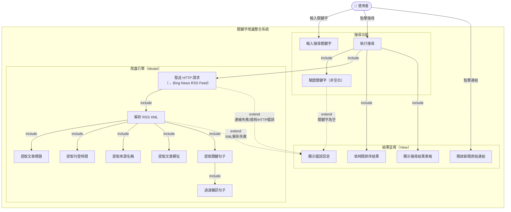

# 關鍵字爬蟲整合系統 — Use Case 總圖

@startuml 關鍵字爬蟲整合系統_UseCase總圖

title 關鍵字爬蟲整合系統\nUse Case 總圖

skinparam packageStyle rectangle
skinparam actorStyle awesome
skinparam usecase {
    BackgroundColor LightYellow
    BorderColor DarkOrange
    ArrowColor DarkSlateGray
}

' ─── 角色定義 ───────────────────────────────────────
actor "使用者" as User

' ─── 系統邊界 ───────────────────────────────────────
rectangle "關鍵字爬蟲整合系統" {

    ' === 搜尋功能群組 ===
    package "搜尋功能" {
        usecase "輸入搜尋關鍵字" as UC1
        usecase "執行搜尋" as UC2
        usecase "驗證關鍵字（非空白）" as UC3
    }

    ' === 爬蟲引擎群組 ===
    package "爬蟲引擎（Model）" {
        usecase "發送 HTTP 請求" as UC4
        usecase "解析 RSS XML" as UC5
        usecase "提取文章標題" as UC6
        usecase "提取刊登時間" as UC7
        usecase "提取來源名稱" as UC8
        usecase "提取文章網址" as UC9
        usecase "提取關鍵句子" as UC10
        usecase "過濾雜訊句子" as UC11
    }

    ' === 結果呈現群組 ===
    package "結果呈現（View）" {
        usecase "顯示搜尋結果表格" as UC12
        usecase "依時間排序結果" as UC13
        usecase "開啟新聞原始連結" as UC14
        usecase "顯示錯誤訊息" as UC15
    }

}

note right of UC4
  呼叫外部資料來源：
  Bing News RSS Feed
  (HTTP GET, timeout 10s)
end note

' ─── 使用者關聯 ─────────────────────────────────────
User --> UC1
User --> UC2
User --> UC14

' ─── include 關係（必定執行） ──────────────────────
UC2 .> UC3 : <<include>>
UC2 .> UC4 : <<include>>
UC4 .> UC5 : <<include>>
UC5 .> UC6 : <<include>>
UC5 .> UC7 : <<include>>
UC5 .> UC8 : <<include>>
UC5 .> UC9 : <<include>>
UC5 .> UC10 : <<include>>
UC10 .> UC11 : <<include>>
UC2 .> UC13 : <<include>>
UC2 .> UC12 : <<include>>

' ─── extend 關係（條件性發生） ─────────────────────
UC15 .> UC2 : <<extend>>\n[連線失敗]
UC15 .> UC2 : <<extend>>\n[請求逾時]
UC15 .> UC2 : <<extend>>\n[HTTP 錯誤]
UC15 .> UC2 : <<extend>>\n[XML 解析失敗]
UC15 .> UC3 : <<extend>>\n[關鍵字為空]

@enduml
```

---

## Mermaid 版本（備用）

貼到 [Mermaid Live](https://mermaid.live/) 或 GitHub / Notion 等支援 Mermaid 的平台。

> 注意：Mermaid 對 Use Case 圖支援有限，以下以流程圖替代呈現邏輯關係。



---

## Use Case 清單說明

| # | Use Case | 角色 | 說明 |
|---|----------|------|------|
| UC1 | 輸入搜尋關鍵字 | 使用者 | 在文字輸入框填入中文或英文關鍵字 |
| UC2 | 執行搜尋 | 使用者 | 點擊「搜尋」按鈕，觸發完整爬取流程 |
| UC3 | 驗證關鍵字（非空白） | 系統 | 確保關鍵字不為空，否則顯示警告 |
| UC4 | 發送 HTTP 請求 | 系統 | 向 Bing News RSS Feed 發 GET 請求（10 秒 timeout）|
| UC5 | 解析 RSS XML | 系統 | 使用 BeautifulSoup lxml-xml 解析回傳的 XML |
| UC6 | 提取文章標題 | 系統 | 從 `<title>` 標籤取得標題文字 |
| UC7 | 提取刊登時間 | 系統 | 解析 `<pubDate>` 為 YYYY/MM/DD HH:MM 格式 |
| UC8 | 提取來源名稱 | 系統 | 從 `<News:Source>` 標籤取得媒體名稱 |
| UC9 | 提取文章網址 | 系統 | 解析 Bing redirect URL 取得原始文章連結 |
| UC10 | 提取關鍵句子 | 系統 | 從 description 依優先序選取最相關句子（≤50字）|
| UC11 | 過濾雜訊句子 | 系統 | 過濾廣告/媒體自介等噪音樣板句 |
| UC12 | 顯示搜尋結果表格 | 系統 | 以 Streamlit DataFrame 呈現結構化結果 |
| UC13 | 依時間排序結果 | 系統 | 按刊登時間由近到遠排序，空值排末 |
| UC14 | 開啟新聞原始連結 | 使用者 | 點擊表格內連結，跳轉至原始文章頁面 |
| UC15 | 顯示錯誤訊息 | 系統 | 依錯誤類型顯示對應提示（連線失敗/逾時/HTTP/解析）|

---

## 角色說明

| 角色 | 類型 | 說明 |
|------|------|------|
| 使用者 | 主角色（Actor） | 透過 Streamlit 網頁介面操作系統的人 |

> **Bing News RSS Feed** 是系統內部呼叫的外部資料來源，不是主動發起互動的角色，故不列為 Actor，以 note 標示於 UC4 旁說明。
